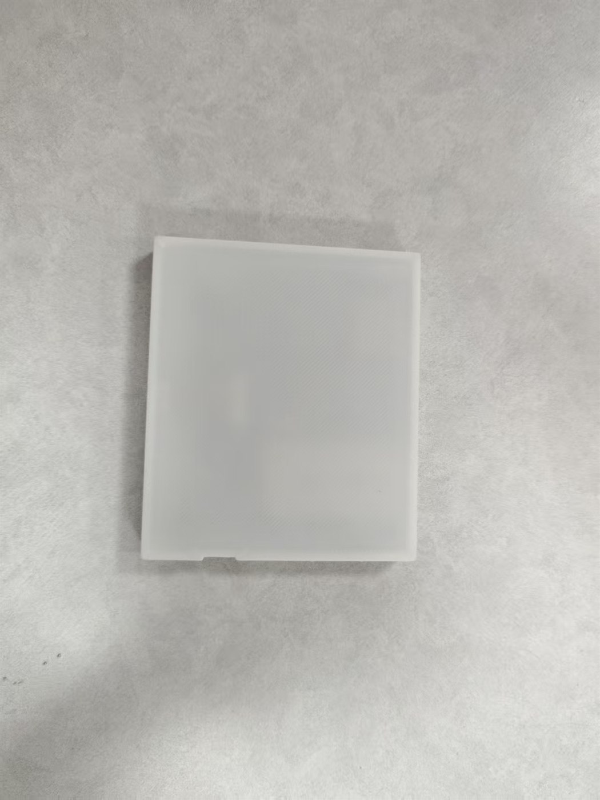
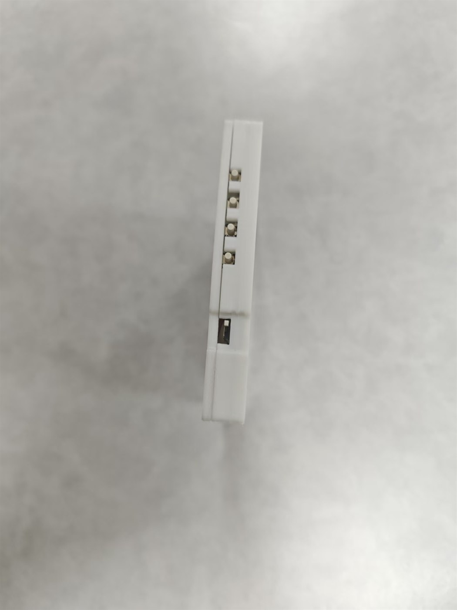
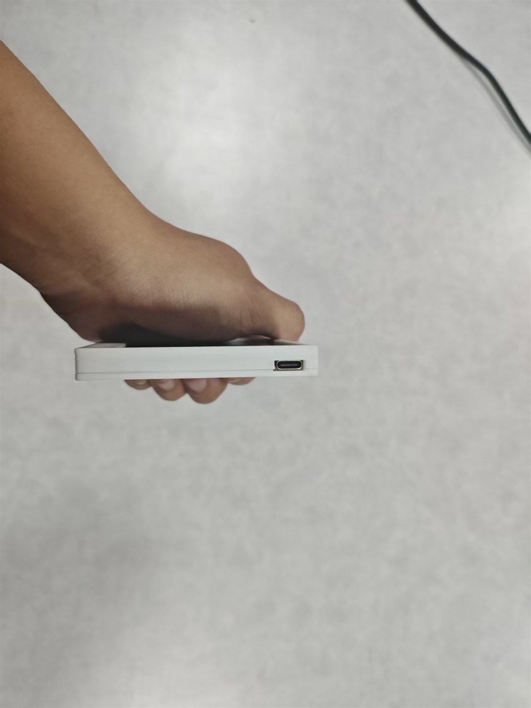
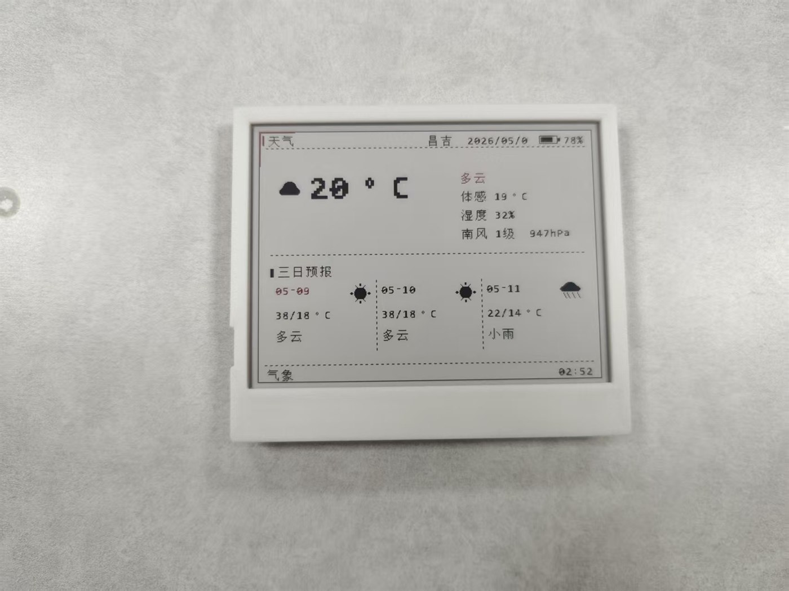

# epaper_uploader — ESP32-S3 智能墨水屏终端

[](https://docs.espressif.com/projects/esp-idf/en/v5.5.1/)
[](LICENSE)
[](#-硬件要求)
[](https://oshwhub.com/team_voosogmo/project_fxbcjhaa)

> ⚠️ **Fork 声明**：本仓库是 [MiaooAim / miaomiao](https://gitee.com/gxp666111/miaomiao)（原项目：epaper_uploader ESP32-S3 智能墨水屏终端）的一个 **fork 分支**，由 [@bluseliu50](https://github.com/bluseliu50) 维护。**本分支可能包含大幅改动**（代码重构、功能增删、文档调整等），与上游不一定保持同步或兼容。如需稳定的原版固件，请以上游 Gitee 仓库为准；如需本分支的改动与设计思路，欢迎在本仓库提 Issue / PR。

> 一款基于 ESP32-S3 的低功耗三色墨水屏智能终端，支持图片展示、天气、时钟、日历、课程表、待办等功能，通过 Web 界面管理，开箱即用。  
> **发布版本：v2.3.3**（与根目录 `CMakeLists.txt` 中 `PROJECT_VER` 一致；烧录后请以串口 `App version` 或 `GET /version` 的 JSON 字段 `version` 为准）。文档导航见 [文档索引.md](文档索引.md)。
> **构建环境**：**ESP-IDF 最低要求 v5.5.1**；同大版本内更高发行版（如 5.5.4）一般可直接使用，若遇兼容问题以 5.5.1 为对照。macOS / Linux 用户可使用仓库根目录的 `Makefile`（`make help`）一键编译烧录，Windows 用户使用 `idf.py`。

## 🔗 项目入口

| 入口 | 用途 |
|------|------|
| [Gitee 固件仓库](https://gitee.com/gxp666111/miaomiao) | ESP32-S3 固件源码、Web 管理页面、文档与免编译烧录包 |
| [嘉立创开源硬件工程](https://oshwhub.com/team_voosogmo/project_fxbcjhaa) | 配套 4.2" SSD1619 PCB、外壳附件与硬件结构 |
| [下载固件烧录包](https://gitee.com/gxp666111/miaomiao/repository/archive/firmware-download.zip) | 直接获取整合烧录 bin，适合不编译直接刷机 |

## 项目状态（v2.3.3 / 2026-06-19）

本项目是一个面向复刻和二次开发的源码公开、非商业许可 ESP32-S3 墨水屏终端固件。当前版本已完成公开发布整理：主测 4.2"/5.83" BWR 屏幕配置，并接入 ATC/Solum 与 EPD-nRF5 参考实验面板入口；完成 PSRAM 友好的图片转换与画板渲染优化，增强画板素材、模板、图层和二维码名片能力，并清理了外部参考包与重复原始素材目录。

2026-06-04 增补 Codex/中转站额度看板：配置页可填写额度 API URL、API Key、显示单位和自动刷新间隔，设备可在墨水屏上显示余额、已用额度、今日用量、请求数和令牌数。启动路径同步显示时已提高 ESP-IDF main task 栈，避免欢迎页切到时钟页时因栈不足重启；当前构建和 release 整包已重新生成并通过 `idf.py build` 验证。

2026-05-09 这一轮按实机反馈补齐了稳定性和小屏显示问题：时钟模式在 SNTP 同步后会自动重绘，SPIFFS 格式化有网页提示并自动重启，4.2" 待办页不再挤压页脚，日历今日圈不遮挡节日/农历文字，英文与全角英文数字显示更完整，SETUP 页 WiFi 热点、密码、网页地址和 mDNS 信息在 400×300 屏上更容易读全。核心固件本地已通过 `idf.py build` 验证。

不同批次的屏幕、驱动 IC、BUSY 电平、供电方案和外壳结构可能存在差异。首次复刻建议先按本文档完成基础烧录与网页配置，再根据实际硬件在配置页选择屏幕型号、确认 BUSY 电平和刷屏效果。欢迎提交 Issue、改进建议或适配更多屏幕型号。

## 💬 交流群（QQ）

- 群号：**1102708081**（用手机 QQ 搜索群号加群，交流使用、复刻与固件问题）

## ✨ 项目亮点

- 🖼️ **三色墨水屏** — 支持黑白红三色显示，Floyd-Steinberg 抖色算法
- 📡 **WiFi 配网** — 手机热点一键配网，mDNS 局域网发现，支持 WPA2/WPA3 自适应认证
- 🌐 **Web 管理** — 响应式 UI，三套主题，手机/电脑均可操作
- 🔋 **超低功耗** — 闲置可进深度睡眠（μA 级），定时器/按键唤醒；双启动路径（完整服务 ↔ 快速刷屏），支持跨深睡的显示模式一致性记忆
- 🔄 **OTA 升级** — 双分区设计，Web 端一键升级固件
- 🔒 **安全与稳定** — 在网页中配置 Basic Auth 后，推屏/配置/数据/媒体接口统一要求授权；前端页面复用 `epdFetchOpts()` 自动携带凭据；多核并发锁、display epoch 与防数据撕裂持续加固
- 📊 **Codex 额度看板** — 支持中转站 `/v1/usage` 额度接口，网页配置 API Key 后可在墨水屏显示余额、用量、请求数和令牌数
- 🎓 **课程表** — 学期周次管理，自动高亮当前课程
- 🌤️ **天气日历** — 和风天气 API + 农历 + 节气 + 节日
- 📋 **待办/倒数日** — 优先级管理 + 进度条 + 目标日期倒数
- 🎨 **画布留言板** — WYSIWYG Web 可视化编辑器，支持文本、形状、图标混合排版

## 📷 功能展示

| 功能 | 说明 |
|------|------|
| 图片展示 | JPEG / PNG / BMP 上传，Floyd-Steinberg 抖色，拉伸全屏显示 |
| 画廊轮播 | 自动顺序 / 随机轮播，间隔可配置 |
| 时钟表盘 | 自动刷新，数字时钟样式，可叠加天气摘要 |
| 万年历 | 月视图 + 农历 + 节气 + 节日 + 今日红圈 |
| 天气 | 和风天气 API，实时 + 3 天预报 |
| 课程表 | 学期周次 + 7×12 网格 + 当前/下节课高亮 |
| 待办事项 | 优先级(普通/重要/紧急) + 完成状态 + 进度条 |
| 倒数日 | 最多 3 个目标日期倒数 |
| Codex 额度 | 中转站额度 API，余额/已用/今日用量/请求数/令牌数看板 |
| 留言板 | 自定义文字 / 字号 / 对齐 / 颜色 |
| 画布留言板 | 可视化 Web 编辑器，支持任意拖拽排版文本、直线、矩形、椭圆与内置/自定义图标 |
| 物理按键 | 3 键切换**上述 8 种**轮显模式（上一个 / 刷新 / 下一个）；留言板与画布**仅通过网页**编辑推屏，不参与按键循环 |
| 深度睡眠 | 闲置自动入睡 + 定时器/按键唤醒 |

下图统一使用 `docs/images/` 下的英文文件名，避免代码托管平台对中文图片路径渲染不稳定。

### Web 界面截图

| `上传面板.png` | `设备配置.png` |
| :---: | :---: |
|  |  |

| `课程表管理.png` | `待办事项.png` |
| :---: | :---: |
|  |  |

### 墨水屏实物

| `4.2寸正面-立绘.jpg` | `4.2寸背壳.jpg` |
| :---: | :---: |
|  |  |

| `4.2寸侧边按键.jpg` | `4.2寸 USB-C 侧边.jpg` |
| :---: | :---: |
|  |  |

| `4.2寸天气模式.jpg` | `4.2寸图片模式.jpg` |
| :---: | :---: |
|  |  |

| `4.2寸待办模式.jpg` | `4.2寸倒数日模式.jpg` |
| :---: | :---: |
|  |  |

| `4.2寸内部结构.jpg` |
| :---: |
|  |

## 🔧 硬件要求

主控为 **ESP32-S3**（建议 **16MB Flash**，常见 **N16** 无 PSRAM 或 **N16R8**）；主测墨水屏为 **4.2" SSD1619（400×300 BWR）** 与 **5.83" UC8179（648×480 BWR）**；电源使用低静态电流 **HE9073A** 及锂电池充放电 IC、烧录可用 **CH340** 或开发板自带 **USB** 等。固件可保存面板配置，建议**保存后重启生效**，避免热切换期间 framebuffer/raw cache 尺寸不一致。

本仓库是固件与 Web 管理端；配套硬件已开源到嘉立创开源硬件平台：[喵哎-MiaooAim 4.2寸 墨水屏 SSD1619](https://oshwhub.com/team_voosogmo/project_fxbcjhaa)。嘉立创工程提供 4.2" SSD1619 PCB、外壳附件与硬件结构，固件烧录、屏幕型号选择和引脚说明仍以本仓库 README 为准。

### 屏幕驱动支持状态

| 状态 | 面板 | 分辨率 | 颜色 | 说明 |
|------|------|--------|------|------|
| 主测 | 4.2" SSD1619 BWR | 400×300 | 黑白红 | 默认小屏路径，稳定全刷；局刷/快刷入口已移除 |
| 主测 | 5.83" UC8179 BWR | 648×480 | 黑白红 | 默认大屏路径；实测局刷不稳定，默认稳定全刷 |
| 已验证 | 微雪 5.83" BWR B V2 | 648×480 | 黑白红 | 配置页可选，真机日志已验证初始化和图片显示 |
| 实验移植 | ATC/Solum SSD1619 / UC8151 / UC 4.3 / dual SSD / UC8159 / UC8179 价签面板 | 144×200 ~ 960×672 | 黑白 / 黑白红 | 参考 atc1441/Tag_FW_nRF52811 控制器序列接入配置页；未实机验证，UC8159 使用默认 VCOM/PLL，缺少源项目外部 EEPROM 回读路径 |
| 实验参考 | EPD-nRF5 SSD1619 / UC8176 / UC8179 / UC8159 / SSD1677 / JD79668 / JD79665 | 400×300 ~ 880×528 | 黑白 / 黑白红 / 黑白红黄 | 参考 EPD-nRF5 控制器命令模型重写接入；JD79668/JD79665 图片转换会生成独立黄色平面并按 2bpp 输出，未实机验证 |

> 除已验证的微雪 5.83" BWR B V2 外，早期微雪 2.9"/2.66"/2.7"/4.26"/5.83 BW 等未验证入口已按当前维护范围移除；7.5" / 4.2" UC8176 等改为 EPD-nRF5 参考实验入口，编号从 26 开始，若 NVS 中仍保存旧面板编号，固件会回退到默认 4.2" 面板。
> ATC/Solum 实验入口只移植屏控初始化与刷屏数据路径，不包含 nRF52811 项目的 UICR 自动识别、EPD 电源脚、BS 脚、3 线回读与外挂 EPD EEPROM 支持；请按配置页面板名手动选择。
> JD79668/JD79665 四色屏的黄色目前作用于图片上传、画廊转换和测试图案；时钟、天气、课程表等内置页面仍使用黑/红两平面 framebuffer。

以下为复刻时常用器件的**示意配图**（文件名与下图一致）；配套 PCB / 外壳见 [嘉立创开源硬件工程](https://oshwhub.com/team_voosogmo/project_fxbcjhaa)，**采购级 BOM 提要**见 [hardware/BOM.md](hardware/BOM.md)、[hardware/BOM_ACTUAL.md](hardware/BOM_ACTUAL.md)，整机原理与排障见 [AGENTS.md](AGENTS.md)。

### 模组（乐鑫原装）

适用于贴片/SMT 或自制载板：**ESP32-S3-WROOM-1U-N16R8**（**1U** = IPEX 外接天线；**N16R8** = 16MB Flash + 8MB PSRAM）。固件**不依赖 PSRAM**，同系列 **N16**（无 R8）亦可，但须满足默认分区对 **16MB Flash** 的要求。

| `模组-ESP32-S3-WROOM-1U-N16R8.png` |
| :---: |
|  |

### 开发板（核心板）

飞线原型、对照 GPIO 丝印时，可使用市售 **ESP32-S3-N16R8 核心板**（示意图见下；具体品牌以实物为准，**请对照本页引脚表**接线）。

| `开发板-ESP32-S3-N16R8核心板.png` |
| :---: |
|  |

### 内部构造（整机 / 自定义 PCB）

磁吸一体板与 DevKit 飞线等**整机内部布置**：

| 内部结构 | 内部结构 |
| :---: | :---: |
|  |  |

> **所有已接入面板共用同一组 GPIO 接线**（见下表）。通过 Web 页面或 `POST /panel_config` 修改 `panel` 字段后，建议重启设备让面板尺寸、预留 framebuffer 与 `/spiffs/image.bin` 重新按新屏幕初始化；无需改线，也不需要修改 `main/epd_stub.c` 的引脚宏。

### 硬件架构与自定义 PCB

自定义 PCB 采用针对 Deep Sleep 优化的电源路径：
1. **锂电池直驱**：使用 **TP4054** 线性充电 IC 进行锂电池充放电管理。
2. **极低待机能耗**：摒弃传统开发板常见的高静态电流稳压器（如 AMS1117），改用 **HE9073A33M5R** 微安级 LDO 提供 3.3V 系统电源，整机深睡电流可低至 15μA。
3. **电量监控**：硬件带有 1:2 分压电阻网络，通过 ADC 接口（BAT_DET）采样电池电量。

如果你没有打样 PCB，也可以使用普通的 ESP32-S3 开发板进行面包板跳线测试。

#### 开发板基础接线图 (面包板测试用)

基础整机示意：**3.7V 电池 → 充放电模块 → 开关 → 开发板 5V 输入**；**水墨屏驱动板**经 SCL/SDI/RES、D/C、CS、BUSY 与 **3V3/GND** 接至开发板对应 IO；**SW3/SW4/SW5** 分别接 **IO9 / IO46 / IO3**，及 **GND** 与下图一致（与下表核对）。


### 引脚连接

| 功能 | GPIO | 连接到 |
|------|------|--------|
| EPD SCK | **4** | 墨水屏 SCL |
| EPD MOSI | **5** | 墨水屏 SDI |
| EPD DC | **7** | 墨水屏 D/C |
| EPD CS | **15** | 墨水屏 CS |
| EPD RST | **6** | 墨水屏 RES |
| EPD BUSY | **16** | 墨水屏 BUSY |
| 按键 SW3 | **9** | 上一个模式 |
| 按键 SW4 | **46** | 刷新当前 |
| 按键 SW5 | **3** | 下一个模式 |

> ⚠️ BUSY 引脚需上拉，不同屏幕 BUSY 极性可能不同，固件支持 NVS 配置。

## 🚀 快速开始

### 1. 环境准备

**ESP-IDF 最低要求 v5.5.1。** 请安装 v5.5.1 或更新的 **5.5.x** 工具链（[官方指南以 5.5.1 为基准](https://docs.espressif.com/projects/esp-idf/en/v5.5.1/esp32s3/get-started/)）：

```powershell
# Windows: 下载 ESP-IDF Tools Installer

# https://dl.espressif.com/dl/esp-idf/?id=Windows

```

### 2. 克隆项目

```bash
git clone https://gitee.com/gxp666111/miaomiao.git
cd miaomiao   # 或你本地的 msp 目录名
```

### 2.5 开发环境（可选）

本仓库涉及两类开发任务，依赖不同：

| 任务 | 是否需要 ESP-IDF | 说明 |
|------|:---:|------|
| **固件编译 / 烧录** | ✅ 需要 | ESP-IDF v5.5.1+（C 交叉编译、CMake、工具链）。macOS/Linux 用 `Makefile`，Windows 用 `idf.py` |
| **字库生成 / 城市码导出 / 主机单元测试** | ❌ 不需要 | 纯 Python 工具 + 纯 C 测试，用 [uv](https://docs.astral.sh/uv/) 管理虚拟环境即可 |

**脱离 ESP-IDF 的开发工具（推荐用 uv）：**

```bash
# 安装 uv（macOS/Linux，一次性）
curl -LsSf https://astral.sh/uv/install.sh | sh
# Windows: powershell -ExecutionPolicy ByPass -c "irm https://astral.sh/uv/install.ps1 | iex"

# 在仓库根目录创建虚拟环境并安装工具依赖（Pillow / openpyxl）
uv sync --group dev

# 字库生成（需要先下载 OFL 字体，见 tools/fetch_open_fonts.py）
make tools-fonts
# 或手动：uv run python tools/gen_ext_font.py --size 32 --out ... --set gb2312 ...

# 城市码 Excel 导出
make tools-city
# 或手动：uv run python tools/gen_city_excel.py

# 主机端单元测试（纯 C，无需 ESP-IDF / 无需硬件）
make test-host
```

> `uv sync` 会在仓库根目录创建 `.venv/`（已被 `.gitignore` 忽略），并用 `uv.lock` 锁定工具依赖版本以保证可复现。固件编译烧录仍需 ESP-IDF，见下方第 4 节。

### 3. 免编译一键烧录

如果只是想把固件烧进设备，不需要安装 ESP-IDF，也不需要自己编译。仓库已提供整包固件。

**推荐下载：** [下载固件烧录包（文件名正常）](https://gitee.com/gxp666111/miaomiao/repository/archive/firmware-download.zip)

下载后先解压，使用里面的 `epaper_uploader_full_16MB.bin` 烧录。这个下载入口使用 Gitee 的仓库打包功能，不走 raw 单文件下载，文件名不会出现单引号。

主仓库内固件路径为：

```text
release/epaper_uploader_full_16MB.bin
```

备用入口：[查看 release 固件目录](https://gitee.com/gxp666111/miaomiao/tree/master/release)。如果你手动点 raw 下载，Gitee 可能把文件名保存成 `'epaper_uploader_full_16MB.bin'`、`epaper_uploader_full_16MB.bin'` 或类似带单引号的名字；这不是文件损坏，手动重命名为 `epaper_uploader_full_16MB.bin` 即可。

在 Espressif Flash Download Tool 的 `SPIDownload` 页面只填一行：

```text
File:    release\epaper_uploader_full_16MB.bin
Address: 0x0000
```

推荐参数：

```text
SPI SPEED: 80MHz
SPI MODE:  DIO
FLASH SIZE: 16MB
DoNotChgBin: 勾选
BAUD: 115200 或 460800
```

新板子或配置混乱时可以先点 `ERASE`，再点 `START`；如果不想清空 WiFi、天气、面板等已有配置，不要点 `ERASE`，直接 `START`。更详细的小白烧录说明见 [release/README.md](release/README.md)。

### 4. 开发者编译与烧录

本项目目标芯片固定为 **ESP32-S3**。仓库已在 `CMakeLists.txt` 和 `.vscode/settings.json` 中写入默认目标；如果你是从 Gitee 源码 ZIP 解压后首次用 VSCode 打开，建议先执行一次“干净配置”，避免旧目录残留的 `build/CMakeCache.txt`、`sdkconfig` 或 VSCode 缓存继续按普通 ESP32 编译。

#### macOS / Linux（Makefile 封装，推荐）

仓库根目录提供跨平台 `Makefile`，封装了 `idf.py` 并**自动探测串口**（macOS 的 `/dev/cu.*` 与 Linux 的 `/dev/ttyACM*` / `/dev/ttyUSB*`），省去手敲串口号。**前置条件**：已安装并激活 ESP-IDF v5.5.1+（`. ~/esp/esp-idf/export.sh`）。

```bash
# 首次：配置目标芯片（只需一次）
make setup

# 编译 + 烧录 + 串口监视（最常用，自动探测串口）
make fm

# 单独编译 / 烧录 / 监视
make build
make flash
make monitor

# 手动指定串口与波特率
make fm PORT=/dev/ttyUSB0 BAUD=921600

# 主机端单元测试（无需硬件，也无需 ESP-IDF）
make test
```

> 查看全部目标：`make help`。`Makefile` 通过 `tools/detect_port.sh` 自动探测串口；若未识别到设备，用 `PORT=/dev/...` 显式指定。本 `Makefile` 仅面向 macOS / Linux；Windows 用户请使用下文的 `idf.py` 命令。

#### Windows / 通用 idf.py 命令

```powershell
# 首次配置目标芯片，只需要执行一次

idf.py set-target esp32s3

# 编译、烧录并打开串口日志

idf.py -p COM3 build flash monitor
```

> 将 `COM3` 替换为你电脑上的实际串口号。日常升级和新芯片首次烧录都使用这条命令，不需要先执行 `erase-flash`。

如果你是从 Gitee 下载 ZIP 后直接编译，或之前在同一目录生成过 `esp32` 的 `sdkconfig`，请先清理并重新设置目标：

```powershell
idf.py fullclean
Remove-Item -Recurse -Force build -ErrorAction SilentlyContinue
idf.py set-target esp32s3
idf.py -p COM3 build flash monitor
```

典型错误特征是日志出现 `Building ESP-IDF components for target esp32`、`GPIO_NUM_46 undeclared` 或 `hal/usb_serial_jtag_ll.h: No such file or directory`。这些都表示当前按普通 ESP32 编译了本 ESP32-S3 固件。

> 不建议把新下载的源码 ZIP 直接覆盖到旧工程目录；如果覆盖后 VSCode 仍然报错，删掉 `build/` 后重新 `idf.py set-target esp32s3` 即可。更稳的方式是用 `git clone` 获取源码。

### 5. 关于 erase-flash

```powershell
# 仅在 Flash 内容混乱、分区表切换或需要完全恢复出厂状态时使用

idf.py -p COM3 erase-flash

# 擦除后重新烧录

idf.py -p COM3 build flash monitor
```

> 注意：`erase-flash` 会清空整颗 Flash，包括 WiFi 配置、NVS 设置、SPIFFS 里的图片和布局。新芯片本来就是空的，不需要先擦除。若擦除后首次启动提示 SPIFFS 未挂载，请连接设备热点进入网页恢复/格式化文件系统。

### 6. 首次使用

1. 设备上电后自动创建 WiFi 热点 `ESP32_EPD_xxxxxx`（默认密码 `12345678`）
2. 手机连接该热点，浏览器打开 `http://192.168.4.1/`
3. 进入「设备配置」→ 连接家庭 WiFi
4. 连接后通过 `http://epdxxxx.local/` 或 STA IP 访问

> 屏幕不亮或面板型号配置错误时，也可以直接连接热点 `ESP32_EPD_xxxxxx`，默认密码为 `12345678`。进入网页后到 `/config` 修改面板型号并重启。

## 📁 项目结构

```
msp/
├── main/                        # 固件源码（C 模块，含 HTTP / EPD / 业务）
│   ├── CMakeLists.txt           # 组件注册、源文件列表、EMBED_FILES
│   ├── idf_component.yml        # ESP-IDF 组件依赖与版本约束
│   ├── app_main.c               # 启动流程（双启动路径：正常/深睡快速刷新）
│   ├── epd_stub.c / epd.h       # EPD 驱动（SSD1619 / UC8179 / ATC-Solum / EPD-nRF5 参考面板，SPI DMA）
│   ├── image_convert.c/h        # 图片解码 + Floyd-Steinberg 抖色
│   ├── http_app.c/h             # HTTP 服务（约 71 条 URI + Basic Auth + OTA）
│   ├── http_gallery.c           # 画廊相关路由
│   ├── http_features.c          # 功能模块路由
│   ├── http_internal.h          # HTTP 子模块共享声明
│   ├── wifi_manager.c/h         # WiFi AP/STA + 配网 + 自动重连
│   ├── scheduler.c/h            # 画廊轮播调度
│   ├── weather.c/h              # 和风天气 HTTPS
│   ├── weather_icons_qw.c/h     # 和风天气离线 1-bit 图标库
│   ├── clock_display.c/h        # 时钟表盘
│   ├── calendar_display.c/h     # 万年历 + 农历
│   ├── lunar.c/h                # 农历算法（1900-2100）
│   ├── timetable.c/h            # 课程表（7×12 网格 + 学期周次）
│   ├── todo.c/h                 # 待办事项（优先级 + 进度条）
│   ├── countdown.c/h            # 倒数日
│   ├── codex_quota.c/h          # Codex / 中转站额度看板
│   ├── message_board.c/h        # 留言板
│   ├── canvas_board.c/h         # WYSIWYG 画布留言板
│   ├── http_canvas.c            # 画布 Web 编辑器路由与图标管理
│   ├── canvas_icons.h           # 内置 1-bit 画布图标库
│   ├── button.c/h               # 三键驱动（轮询 + 去抖）
│   ├── battery_mon.c/h          # 电池电压检测与百分比估算
│   ├── fb_render.c/h            # 帧缓冲渲染引擎
│   ├── font_data.h              # 点阵字库（ASCII + 中文）
│   ├── ui_theme.c/h             # 墨水屏页面通用 UI 主题组件
│   ├── display_policy.c/h       # 显示策略协调
│   ├── display_mode.c/h         # 显示模式注册与切换
│   ├── power_mgr.c/h            # 深度睡眠与电源管理
│   ├── time_sync.c/h            # SNTP 时间同步
│   ├── device_identity.c/h      # 设备标识（MAC → AP SSID / mDNS）
│   ├── nvs_utils.c/h            # NVS 工具函数
│   ├── spiffs_mount.c/h         # SPIFFS 挂载 + 健康检查（挂载失败不自动格式化用户数据）
│   └── lodepng.c/h              # LodePNG 第三方 PNG 解码库
├── web/                         # Web UI（构建时嵌入固件）
│   ├── index.html               # 主页：上传 / 画廊 / 状态
│   ├── config.html              # 配置：WiFi / 轮播 / 天气 / OTA / 低功耗
│   ├── timetable.html           # 课程表编辑
│   ├── todo.html                # 待办事项管理
│   ├── countdown.html           # 倒数日配置
│   └── board.html               # 画布留言板可视化编辑器
├── tools/                       # 辅助脚本
│   ├── gen_font.py              # 点阵字库生成工具
│   ├── gen_city_excel.py        # 和风天气城市码导出
│   ├── font_extra_chars.txt     # 字库补字清单
│   ├── unifont.hex.gz           # 字库生成输入
│   ├── update_gitee_about.ps1   # Gitee 仓库简介同步脚本
│   └── detect_port.sh           # macOS/Linux 串口自动探测（供 Makefile 使用）
├── hardware/                    # 硬件提要（采购清单暂不公开）
│   ├── 开发板接线图.png           # 开发板 / 屏 / 按键 / 电源接线示意
│   ├── BOM_ACTUAL.md            # 与固件兼容性提要
│   └── BOM.md                   # 与固件兼容性提要
├── docs/                        # Gitee 简介与 README 使用的硬件、实物、Web 截图
│   ├── gitee-about.md           # Gitee 仓库简介建议
│   └── images/                  # README 使用图片
├── release/                     # 免编译烧录包与小白烧录说明
│   ├── README.md
│   ├── epaper_uploader_full_16MB.bin
│   └── epaper_uploader_full_16MB.zip
├── partitions.csv               # 分区表（3MB app 三槽 + coredump + fontfs + 用户 SPIFFS）
├── sdkconfig.defaults           # 项目默认配置
├── CMakeLists.txt               # 顶层构建脚本
├── Makefile                     # macOS / Linux 构建 + 工具脚本（封装 idf.py / uv）
├── pyproject.toml               # Python 工具依赖声明（uv 管理，脱离 ESP-IDF）
├── uv.lock                      # uv 工具依赖版本锁定（保证可复现）
```

## 🔌 分区表

| 分区 | 类型 | 大小 | 说明 |
|------|------|------|------|
| nvs | data | 48 KB | 非易失性配置存储（PHY 校准 + 各模块 blob） |
| otadata | data | 8 KB | OTA 状态 |
| phy_init | data | 4 KB | PHY 初始化基线数据 |
| factory | app | 3 MB | 出厂固件槽，保留回滚/救援入口 |
| ota_0 / ota_1 | app | 各 3 MB | OTA 双分区，当前固件仍有约 37% app 余量 |
| coredump | data | 128 KB | panic / watchdog 崩溃转储，便于售后排障 |
| fontfs | data | 2.875 MB | 内置 16/24/32px 字库资源分区 |
| spiffs | data | 3.875 MB | 用户图片、画布素材和运行时文件 |

> 当前分区表面向 16MB Flash。`spiffs` 用户文件区固定在 `0xC20000`，用于尽量保护已有图库/配置；`fontfs` 位于 `0x940000`。分区表或字库分区变更后，不能只 OTA app，需要同时更新 `partition_table` 和 `fontfs.bin`，出厂包建议使用完整 16MB 固件。

## 🌐 Web API 概览

设备提供 **约 63 条 HTTP 路由**（方法+路径组合，以 `http_app.c` 注册表为准），主要分类：

| 分类 | 路径 | 说明 |
|------|------|------|
| 页面 | `/`, `/config`, `/timetable`, `/todo`, `/countdown` | Web UI 页面 |
| 图片 | `/upload`, `/images`, `/image`, `/show`, `/delete` | 画廊管理 |
| WiFi | `/wifi_status`, `/scan`, `/wifi_connect`, `/wifi_forget` | 网络配置 |
| 屏幕 | `/panel_config` | 屏幕型号切换 |
| 天气 | `/weather_config`, `/weather_show` | 天气配置与显示 |
| 课程表 | `/timetable.json`, `/timetable`, `/timetable_show` | 课程表管理 |
| 待办 | `/todo.json`, `/todo`, `/todo_show` | 待办事项管理 |
| 倒数日 | `/countdown_config`, `/countdown_show` | 倒数日管理 |
| Codex 额度 | `/codex_quota_config`, `/codex_quota_show` | 中转站额度配置与显示 |
| 画布留言板 | `/board`, `/canvas_layout`, `/canvas_show`, `/canvas_icon_upload` | WYSIWYG 画板与素材管理 |
| 系统 | `/status`, `/version`, `/ota`, `/auth_config`, `/power_config` | 系统管理 |

> 📖 完整 API 与架构说明见 [AGENTS.md](AGENTS.md)；完整路由以 `main/http_app.c` 注册表为准。

## ⚡ 低功耗模式

| 模式 | 电流 | 唤醒源 | 说明 |
|------|------|--------|------|
| 活跃 | 150-300mA | 按键/HTTP | 正常工作 |
| 深度睡眠 | <10μA | RTC 定时器 / GPIO | 电池续航 80+ 天 |

**双启动路径设计**（深度睡眠开启且本次为 **RTC 定时器** 唤醒时）：
- **完整启动**（上电 / 复位 / **按键 GPIO3·9 唤醒** 等）：AP+STA、mDNS、`http_app`、按键任务、欢迎屏流程；**可通过网页访问**。
- **定时器唤醒**：仅 STA、刷新 `NVS` 中记忆的模式画面后回睡；**不启动 HTTP / 不配 SoftAP**，无法在此阶段打开网页。

**HTTP Basic Auth**：可在配置页启用。启用后敏感操作需带 `Authorization`；各 `web/*.html` 在配置页保存认证后使用 `localStorage`（`epd_auth_u` / `epd_auth_p`）自动附带请求头。配置导出/导入不会包含认证密码，恢复备份后请在配置页单独设置管理账号。详见 [AGENTS.md](AGENTS.md)。

## 📚 文档导航

| 文档 | 说明 | 适用人群 |
|------|------|---------|
| [文档索引.md](文档索引.md) | 全部文档导航与按角色检索 | 所有人 |
| [AGENTS.md](AGENTS.md) | 代码库指南（架构/API/模块/约定/测试）⭐ | 开发者 / AI 助手 |
| [CHANGELOG.md](CHANGELOG.md) | 版本更新记录 | 用户 / 维护者 |
| [CONTRIBUTING.md](CONTRIBUTING.md) | Issue / PR / 屏幕适配贡献规范 | 贡献者 |
| [hardware/BOM.md](hardware/BOM.md) | 硬件与固件对齐提要（无采购表） | 复刻者 |
| [COURSE_TABLE_README.md](COURSE_TABLE_README.md) | 课程表功能说明 | 课程表用户 |

> **说明**：屏幕切换、ATC/Solum 与 EPD-nRF5 参考实验面板适配状态和排障步骤见 [AGENTS.md](AGENTS.md)；若你本地另有 `docs/` 子目录教辅材料，以实际仓库文件为准。

## 🤝 参与贡献

欢迎提交屏幕适配、网页体验、文档和排障反馈。提交前请先阅读 [CONTRIBUTING.md](CONTRIBUTING.md)，并尽量附带屏幕型号、驱动 IC、BUSY 电平、ESP-IDF 版本、串口日志和复现步骤。

## 📄 许可证

本仓库采用 **[PolyForm Noncommercial License 1.0.0](https://polyformproject.org/licenses/noncommercial/1.0.0)**（全文见根目录 [`LICENSE`](LICENSE)）。这意味着本项目是**源码公开、非商业许可**项目，不等同于 MIT / Apache / GPL 等 OSI 意义上的开源许可。

- **允许**：个人学习、研究、修改与非商业性使用、分发（须附带许可证全文）。
- **商业使用**：默认**不在** PolyForm 非商业许可范围内；若你希望将本项目用于营利（如量产销售、商用 SaaS 等），须事先联系著作权人并取得**书面同意**，双方可另签商业许可协议。中国大陆商业授权提示见 [`COMMERCIAL_LICENSE.md`](COMMERCIAL_LICENSE.md)。
- PolyForm 对「非营利机构、学校、部分公共机构」等有单独说明，请以英文正文为准。**商用 / 授权洽谈**：`430601574@qq.com`，微信 `GXPmiaomiao`，或 Gitee 仓库 Issue / 私信。

**免责声明**：以上内容仅为项目授权说明，不构成法律意见。若涉及商业使用、再分发、再授权或争议处理，请咨询专业律师；`LICENSE` 顶部的 `Required Notice` 应与实际著作权人或授权主体保持一致。

---

> 💡 **复刻提示**：当前 Gitee 仓库公开固件、Web、硬件接线提要和展示素材；配套 4.2" SSD1619 PCB / 外壳已发布在 [嘉立创开源硬件工程](https://oshwhub.com/team_voosogmo/project_fxbcjhaa)。若你需要采购级 BOM 或其他屏幕硬件版本，请通过 Issue / 交流群确认最新发布状态。
